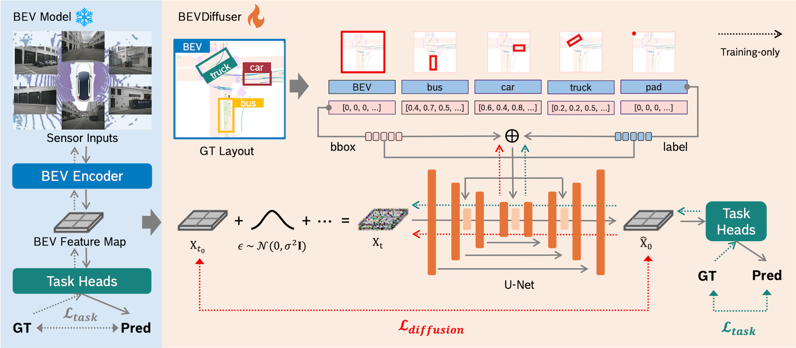

<div align="center">
<h2> BEVDiffuser: Plug-and-Play Diffusion Model for BEV Denoising</br>with Ground-Truth Guidance</h2> 

**CVPR 2025 Highlight**

<a href="https://arxiv.org/pdf/2502.19694"></a>
<a href='https://xin-ye-1.github.io/BEVDiffuser/'></a>


<br>
</div>


Official implementation of BEVDiffuser. 

## BEVDiffuser with BEVFormer
- [Installation](BEVFormer/docs/install.md)
- [Prepare Dataset](BEVFormer/docs/prepare_dataset.md)
- [Run and Eval](BEVFormer/docs/getting_started.md)

## Acknowledgement
Large parts of the code base are inspied and build on top of the following projects:
- [BEVFormer](https://github.com/fundamentalvision/BEVFormer)
- [LayoutDiffusion](https://github.com/ZGCTroy/LayoutDiffusion)
- [diffusers](https://github.com/huggingface/diffusers)

## Citation

If find this work helpful, please consider citing: (bibtex)

```
@InProceedings{ye2025bevdiffuser,
    author={Ye, Xin and Yaman, Burhaneddin and Cheng, Sheng and Tao, Feng and Mallik, Abhirup and Ren, Liu},
    title={BEVDiffuser: Plug-and-Play Diffusion Model for BEV Denoising with Ground-Truth Guidance},
    booktitle = {Proceedings of the IEEE/CVF Conference on Computer Vision and Pattern Recognition},
    month = {June},
    year = {2025}
}
```
